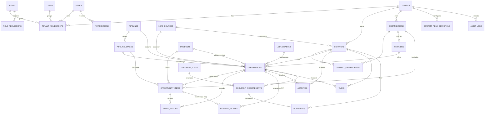

# Database Specification

Canonical reference for the schema. The Drizzle schema in `src/db/schema/` implements this;
if they disagree, fix one of them in the same change. DDL below is written for readability
(Postgres syntax, abbreviated) — Drizzle is the implementation.

**Legend:** 🟢 MVP (Phase 1) · 🟡 Phase 2 (table designed now, built later) · 🔵 Phase 3

---

## 1. Conventions

| Topic | Rule |
|---|---|
| Primary keys | `id uuid primary key default gen_random_uuid()`. Exception: `audit_logs.id bigint identity`. |
| Tenant column | `tenant_id uuid not null references tenants(id) on delete restrict` on every tenant-owned table, plus `unique (tenant_id, id)`. |
| Cross-row references | **Composite FKs** `(tenant_id, x_id) → x(tenant_id, id)`. A row can never point at another tenant's row. |
| User references | `(tenant_id, user_id) → tenant_memberships(tenant_id, user_id)` — the user must be a member of that tenant. |
| Timestamps | `timestamptz`, UTC. `created_at`/`updated_at default now()`; `updated_at` maintained by trigger `set_updated_at()`. |
| Actors | `created_by`, `updated_by uuid` (user id) on human-edited records. |
| Soft delete | `deleted_at timestamptz` on business records. Hard delete only via retention jobs. |
| Enums | Postgres enums for **code-level** states (e.g. `task_status`). Tenant-configurable lists (stages, sources, lost reasons, document types) are **tables**, never enums. |
| Money | `numeric(14,2)` + `currency char(3)` (ISO 4217). |
| Custom fields | `custom_fields jsonb not null default '{}'` on contacts, organizations, opportunities, products. GIN index. |
| Naming | snake_case tables (plural) and columns. FK columns end in `_id`. Booleans start with `is_`/`has_`. |
| Extensions | `pgcrypto` (gen_random_uuid), `pg_trgm` (fuzzy name match), `citext` (optional), `pg_cron` (scheduled jobs). |

---

## 2. Entity-relationship diagram



---

## 3. Tenancy, identity & access 🟢

### tenants
Not tenant-owned (it *is* the tenant). Created by self-serve sign-up — see `onboarding.md`.
```sql
id               uuid pk
name             text not null
slug             text not null unique          -- the workspace address: {slug}.meroidea.app
status           tenant_status not null default 'trialing'  -- trialing | active | past_due | suspended | cancelled
industry         text                           -- chosen at sign-up; picks the starting template
template_code    text                           -- template applied, e.g. 'education_agency@1'
onboarding       jsonb not null default '{}'    -- setup checklist state
logo_path        text                           -- storage path in bucket 'branding'
primary_color    text                           -- '#4B49AC'; validated hex
timezone         text not null default 'UTC'    -- IANA, e.g. 'Australia/Sydney'
default_currency char(3) not null default 'USD'
default_country  char(2)                        -- ISO 3166; phone number parsing default
locale           text not null default 'en'
labels           jsonb not null default '{}'    -- see §9
settings         jsonb not null default '{}'    -- see §9
created_at, updated_at
```

**Added by ADR-029:** `tenants.features text[] not null default '{}'` holds the feature keys
switched on for the business. `tenant_memberships.is_support boolean not null default false`
marks a platform owner's temporary seat (check: a support seat is always `active`).

### users
Global application profile, 1:1 with `auth.users`. **Not** tenant-owned (a user can belong
to several tenants — needed for resellers, partner staff, and our own support access).
```sql
id          uuid pk references auth.users(id) on delete cascade
email       text not null
full_name   text not null
avatar_path text
phone       text
created_at, updated_at
```
Created by a trigger on `auth.users` insert (or by the invite action).

RLS: a person reads themselves and colleagues with an **active** membership in a shared tenant
(`users_read_colleagues`). People with `users.manage` also read every member of the active
tenant whatever their status (`users_read_managed`, migration 0025), so a deactivated login can
be switched back on.

### tenant_memberships
```sql
id           uuid pk
tenant_id    uuid not null
user_id      uuid not null references users(id)
role_id      uuid not null            -- (tenant_id, role_id) → roles
team_id      uuid                     -- (tenant_id, team_id) → teams
status       membership_status not null default 'invited'  -- invited | active | deactivated
job_title    text
invited_by   uuid
last_seen_at timestamptz
created_at, updated_at
unique (tenant_id, user_id)
index (user_id) where status = 'active'
```
Deactivating a membership keeps all their records (owner stays for history); reassign via bulk action.

### invitations 🟢 (designed, not built — staff are added directly, see ADR-031)
```sql
id, tenant_id,
email        text not null            -- lowercased
role_id      uuid not null            -- (tenant_id, role_id) → roles
team_id      uuid
token_hash   text not null            -- sha256 of a 32-byte random token; the raw token only ever
                                      -- exists in the emailed link
expires_at   timestamptz not null     -- created_at + 7 days
invited_by   uuid not null
accepted_at, revoked_at timestamptz
accepted_user_id uuid
sent_count   int not null default 1
last_sent_at timestamptz not null default now()
created_at
unique (tenant_id, email) where accepted_at is null and revoked_at is null
index (token_hash)
```
Single use. Accepting creates/activates the membership in the same transaction and writes an audit row.

### tenant_subscriptions 🟢 (billing state; Stripe is the source of truth)
```sql
id, tenant_id unique,
plan_code            text not null default 'trial'   -- trial | starter | team | business
status               text not null                    -- trialing | active | past_due | canceled
seats                int not null default 1           -- paid seats; active memberships must not exceed
stripe_customer_id, stripe_subscription_id text
trial_ends_at, current_period_end, cancel_at, canceled_at timestamptz
created_at, updated_at
```
Entitlements (seat limits, feature flags, storage) are a **code table** keyed by `plan_code`,
checked server-side before invites, feature use and uploads.

### teams
```sql
id, tenant_id, name text not null,
manager_user_id uuid,                 -- (tenant_id, manager_user_id) → tenant_memberships
created_at, updated_at
unique (tenant_id, name)
```
A manager's `team` scope = records owned by members of teams they manage **plus** their own team.

### roles
```sql
id, tenant_id,
key         text not null      -- 'owner', 'manager', 'consultant', 'ops' (stable, used in seeds/tests)
name        text not null      -- display, editable
description text
is_system   boolean not null default false   -- owner role: cannot delete, cannot remove users.manage
created_at, updated_at
unique (tenant_id, key)
```

### role_permissions
The permission **catalog lives in code** (`src/lib/permissions/catalog.ts`), versioned with
the features that check it. The DB stores only grants.
```sql
tenant_id  uuid not null
role_id    uuid not null          -- (tenant_id, role_id) → roles on delete cascade
permission text not null          -- e.g. 'opportunities.view'; validated against catalog
scope      permission_scope       -- own | team | all; null for non-record permissions
primary key (role_id, permission)
```

---

## 4. CRM core 🟢

### lead_sources
```sql
id, tenant_id, name text not null,
type       lead_source_type not null   -- manual | web_form | social | referral | partner | walk_in | import | api | other
is_active  boolean not null default true,
position   int not null default 0,
created_at, updated_at
unique (tenant_id, name)
```
`type = 'partner'` makes `partner_id` required on opportunities created with this source.

### contacts
Built in milestone 6 (migrations `0004`–`0005`) without `partner_id` and
`referred_by_contact_id`; those columns arrive with the `partners` table (milestone 8).
`phone_e164` is filled by `src/lib/normalize.ts` from the tenant's default country.
```sql
id, tenant_id,
first_name        text not null
last_name         text
full_name         text generated always as (trim(first_name || ' ' || coalesce(last_name,''))) stored
email             text
email_normalized  text        -- lower(trim(email)); set in service layer
phone             text        -- as entered
phone_e164        text        -- normalized with libphonenumber-js using tenant.default_country
alt_phone         text
date_of_birth     date        -- sensitive: requires contacts.view_sensitive
gender            text
address_line, city, region    text
country           char(2)
status            contact_status not null default 'active'   -- active | inactive | do_not_contact
owner_user_id     uuid        -- (tenant_id, owner_user_id) → tenant_memberships(tenant_id, user_id)
source_id         uuid        -- (tenant_id, source_id) → lead_sources
partner_id        uuid        -- (tenant_id, partner_id) → partners; referring partner
referred_by_contact_id uuid   -- (tenant_id, …) → contacts; individual referrals
marketing_consent boolean not null default false
consent_updated_at timestamptz
custom_fields     jsonb not null default '{}'
last_activity_at  timestamptz
search            tsvector generated always as (
                    to_tsvector('simple', coalesce(first_name,'') || ' ' || coalesce(last_name,'') || ' ' ||
                    coalesce(email,'') || ' ' || coalesce(phone,''))) stored
created_at, updated_at, created_by, updated_by, deleted_at

index (tenant_id, owner_user_id) where deleted_at is null
index (tenant_id, email_normalized) where deleted_at is null and email_normalized is not null
index (tenant_id, phone_e164)       where deleted_at is null and phone_e164 is not null
index using gin (search)
index using gin (full_name gin_trgm_ops)
index using gin (custom_fields jsonb_path_ops)
```
No unique constraint on email/phone: siblings and parents share them. Duplicate handling is
a service-layer warning (§10).

### organizations
```sql
id, tenant_id, name text not null,
type          text        -- tenant-configurable via settings.organization_types: 'institution', 'agency', 'company'…
email, phone, website text,
address_line, city, region text, country char(2),
owner_user_id uuid,
custom_fields jsonb not null default '{}',
created_at, updated_at, created_by, updated_by, deleted_at
index (tenant_id, name) ; gin trgm on name
```

### contact_organizations
```sql
id, tenant_id, contact_id, organization_id,
relationship text not null   -- 'student_of', 'employee', 'guardian_at'… free text in MVP
is_primary   boolean not null default false
created_at
unique (tenant_id, contact_id, organization_id, relationship)
```

### products
```sql
id, tenant_id, name text not null, code text, description text,
type     text not null default 'service'   -- tenant-defined: education seeds 'service' (fee packages) and 'course'
category text, organization_id uuid,        -- e.g. the institution offering the course
level    text,                              -- e.g. 'Bachelor', 'Master', 'Diploma' (courses)
default_price numeric(14,2), currency char(3),
is_active boolean not null default true,
custom_fields jsonb not null default '{}',
created_at, updated_at, deleted_at
unique (tenant_id, code)
```

### pipelines
```sql
id, tenant_id, name text not null, description text,
object_type      pipeline_object not null default 'opportunity'   -- opportunity | opportunity_item
item_pipeline_id uuid        -- for opportunity pipelines: the pipeline its items use (e.g. 'Applications')
is_default boolean not null default false,
is_active  boolean not null default true,
position   int not null default 0,
created_at, updated_at
unique (tenant_id, object_type) where is_default      -- one default per object type
```
Opportunities and items reuse the same pipeline/stage tables, stage editor UI, and history.

### pipeline_stages
```sql
id, tenant_id, pipeline_id,               -- (tenant_id, pipeline_id) → pipelines
name             text not null
position         int not null
category         stage_category not null default 'open'   -- open | won | lost
probability      smallint check (probability between 0 and 100)
color            text
stale_after_days int                      -- overrides tenant default for "stuck" detection
advances_parent_to_stage_id uuid          -- item stages only: entering this stage moves the parent
                                          -- opportunity forward to that stage (never backwards)
is_active        boolean not null default true
created_at, updated_at
unique (pipeline_id, position) deferrable initially deferred   -- allows reorder in one tx
```
Rules: each pipeline has at least one `open`, one `won`, and one `lost` stage. A stage with
opportunities cannot be deleted — deactivate it and move its opportunities first.

### lost_reasons
```sql
id, tenant_id, name text not null, is_active boolean default true, position int,
created_at, updated_at
unique (tenant_id, name)
```

### opportunities
```sql
id, tenant_id,
contact_id          uuid not null     -- (tenant_id, contact_id) → contacts
organization_id     uuid              -- B2B account, if any
name                text not null     -- 'Master of Business Analytics — Australia, Feb 2027'
pipeline_id         uuid not null
stage_id            uuid not null     -- (tenant_id, stage_id) → pipeline_stages; must belong to pipeline_id
status              opportunity_status not null default 'open'   -- open | won | lost (mirrors stage.category)
owner_user_id       uuid              -- null = unassigned queue
source_id           uuid
partner_id          uuid              -- referral partner (resale/B2B model)
partner_reference   text              -- the partner's own reference number
product_id          uuid              -- primary product, e.g. the service package sold
amount              numeric(14,2)     -- direct value: education = service fee charged to the student
currency            char(3)           -- item revenue (commissions) lives on opportunity_items
expected_close_date date
stage_entered_at    timestamptz not null default now()
closed_at           timestamptz
lost_reason_id      uuid
lost_reason_note    text
last_activity_at    timestamptz
next_task_due_at    timestamptz       -- denormalized: earliest open task; drives "no next step" report
custom_fields       jsonb not null default '{}'
created_at, updated_at, created_by, updated_by, deleted_at

check (status <> 'lost' or lost_reason_id is not null)
index (tenant_id, pipeline_id, stage_id) where deleted_at is null   -- board
index (tenant_id, owner_user_id, status) where deleted_at is null   -- my pipeline
index (tenant_id, partner_id) where partner_id is not null
index (tenant_id, source_id, created_at)
index (tenant_id, status, last_activity_at)                         -- stale detection
index (tenant_id, contact_id)
index using gin (custom_fields jsonb_path_ops)
```
Board ordering: by `last_activity_at desc` within a stage (no manual card ordering in MVP).

### opportunity_items 🟢 (not built yet — milestone 8)
Applications (education), offers (real estate), submissions (recruitment). One opportunity
has many; each has its own stage in an `opportunity_item` pipeline and its own revenue.
```sql
id, tenant_id,
opportunity_id      uuid not null     -- (tenant_id, opportunity_id) → opportunities
organization_id     uuid not null     -- the institution / counterparty
product_id          uuid              -- the course, if catalogued
title               text not null     -- 'Master of Data Science — Feb 2027' (free text; catalogue optional)
pipeline_id         uuid not null     -- an object_type='opportunity_item' pipeline
stage_id            uuid not null
status              opportunity_status not null default 'open'   -- mirrors stage.category
stage_entered_at    timestamptz not null default now()
closed_at           timestamptz
lost_reason_id      uuid
external_reference  text              -- institution's application ID / student ID
base_amount         numeric(14,2)     -- education: tuition fee the commission is based on
revenue_rate        numeric(7,4)      -- education: commission % (e.g. 15.0000)
expected_revenue    numeric(14,2)     -- defaults to base_amount × rate / 100; editable (bonuses, flat fees)
currency            char(3)           -- institution's currency (AUD, GBP, CAD…)
owner_user_id       uuid              -- defaults to opportunity owner; ops staff may own processing
custom_fields       jsonb not null default '{}'   -- intake, campus, onshore/offshore, CRICOS code…
position            int not null default 0        -- student's preference order
created_at, updated_at, created_by, updated_by, deleted_at

check (status <> 'lost' or lost_reason_id is not null)
index (tenant_id, opportunity_id) where deleted_at is null
index (tenant_id, organization_id, status)          -- institution page, offer-rate reports
index (tenant_id, pipeline_id, stage_id) where deleted_at is null
index using gin (custom_fields jsonb_path_ops)
```
Access follows the parent opportunity (see `permissions.md`).

### stage_history
Built in `0007`–`0008` for opportunities only; `opportunity_item_id` arrives with opportunity items.
One row per **visit** to a stage, for opportunities and items. Powers time-in-stage, funnel
conversion, velocity, and offer-rate reports.
```sql
id, tenant_id,
opportunity_id      uuid not null
opportunity_item_id uuid              -- null = the opportunity's own stage; set = that item's stage
stage_id     uuid not null
entered_at   timestamptz not null
exited_at    timestamptz                 -- null = current stage
entered_by   uuid                        -- user id; null = system/automation
duration     interval generated always as (exited_at - entered_at) stored
index (tenant_id, opportunity_id, entered_at)
index (tenant_id, opportunity_item_id, entered_at) where opportunity_item_id is not null
index (tenant_id, stage_id, entered_at)
unique (opportunity_id)      where exited_at is null and opportunity_item_id is null   -- one open visit
unique (opportunity_item_id) where exited_at is null and opportunity_item_id is not null
```
Written only by the `moveStage()` / `moveItemStage()` services, in the same transaction as the stage update.

---

## 5. Activities & tasks 🟢

### activities
Built in `0007` without `opportunity_item_id`, `outcome` values free text; the system types used so far are
`stage_changed | owner_changed | created | task_completed | imported`.
Immutable-ish history (edit allowed to author within 24h; always audited).
```sql
id, tenant_id,
type             activity_type not null
  -- interactions: call | email | meeting | message | note
  -- system:       stage_changed | owner_changed | created | document_uploaded |
  --               document_verified | task_completed | imported | merged
channel          text          -- for type=message: 'whatsapp' | 'viber' | 'messenger' | 'sms' …
direction        activity_direction   -- inbound | outbound; null for notes/system
subject          text
body             text
outcome          text          -- calls: 'connected', 'no_answer', 'left_voicemail'…
duration_seconds int
occurred_at      timestamptz not null default now()
contact_id       uuid
opportunity_id   uuid
opportunity_item_id uuid       -- e.g. "emailed the university about this application"
organization_id  uuid
task_id          uuid          -- the task this completed, if any
actor_user_id    uuid          -- who did it; null for system
metadata         jsonb not null default '{}'   -- system events: {from_stage_id, to_stage_id} etc.
external_id      text          -- email message-id etc.; unique per tenant when set
created_at, updated_at, created_by, deleted_at

check (num_nonnulls(contact_id, opportunity_id, organization_id) >= 1)
index (tenant_id, contact_id, occurred_at desc)
index (tenant_id, opportunity_id, occurred_at desc)
index (tenant_id, actor_user_id, occurred_at desc)   -- activity-per-consultant reports
unique (tenant_id, external_id) where external_id is not null
```
Logging an interaction updates `last_activity_at` on the contact and opportunity (service layer).
System events do **not** update `last_activity_at` (moving a card isn't talking to the student).

### tasks
```sql
id, tenant_id,
title        text not null
description  text
type         task_type not null default 'follow_up'   -- call | email | meeting | follow_up | document | other
status       task_status not null default 'open'      -- open | completed | cancelled
priority     task_priority not null default 'normal'  -- low | normal | high
due_at       timestamptz
remind_at    timestamptz
assigned_to  uuid not null     -- (tenant_id, assigned_to) → tenant_memberships
contact_id, opportunity_id, opportunity_item_id  uuid
completed_at timestamptz
completed_by uuid
created_at, updated_at, created_by, updated_by, deleted_at

index (tenant_id, assigned_to, status, due_at) where deleted_at is null   -- My Day
index (tenant_id, opportunity_id) where status = 'open'
index (status, remind_at) where status = 'open' and remind_at is not null  -- cron
```
Overdue is computed (`status = 'open' and due_at < now()`), never stored.

---

## 6. Documents 🟢

### document_types
```sql
id, tenant_id, name text not null, description text,
level        document_level not null default 'contact'
             -- contact:     once per person, reused by every application (passport, transcripts, English test)
             -- opportunity: once per case (service agreement, GS statement, financial documents)
             -- item:        once per application (offer letter, CoE, acceptance form)
pipeline_id  uuid          -- null = applies to all pipelines
is_required  boolean not null default false   -- auto-added to checklist on new opportunity
is_sensitive boolean not null default true    -- download requires documents.download
position int, is_active boolean default true,
created_at, updated_at
unique (tenant_id, name)
```

### document_requirements (the checklist)
```sql
id, tenant_id, document_type_id,
contact_id          uuid not null
opportunity_id      uuid          -- set for opportunity- and item-level types
opportunity_item_id uuid          -- set for item-level types
status       document_status not null default 'pending'  -- pending | received | verified | rejected | waived
expires_on   date                 -- passports, English tests, visas expire
due_date     date
notes        text
verified_by  uuid, verified_at timestamptz
created_at, updated_at
unique (tenant_id, document_type_id, contact_id, opportunity_id, opportunity_item_id) nulls not distinct
```
The checklist shown on an application = its item-level requirements + its case's
opportunity-level requirements + the student's contact-level requirements. A passport verified
once is verified for every application.
Upload linked to a requirement moves it `pending → received`. `verified`/`rejected` need
`documents.verify`.

### documents (files)
```sql
id, tenant_id,
contact_id      uuid not null
opportunity_id  uuid
opportunity_item_id uuid
requirement_id  uuid
document_type_id uuid
file_name       text not null     -- original name, display only
storage_path    text not null unique   -- '{tenant_id}/contacts/{contact_id}/{uuid}' — server-generated
mime_type       text not null
size_bytes      bigint not null
sha256          text
uploaded_by     uuid not null
created_at, deleted_at
index (tenant_id, contact_id) ; index (tenant_id, opportunity_id) ; index (requirement_id)
```

---

## 7. Partners 🟢 / 🟡

### partners 🟢
```sql
id, tenant_id,
organization_id  uuid not null     -- partner is always an organization
status           partner_status not null default 'active'   -- prospect | active | inactive
commission_type  commission_type not null default 'none'    -- none | percentage | fixed
commission_basis commission_basis                           -- item_revenue | direct_revenue | both | per_won_item
                                                            -- education: our institution commission | our service fee | both | flat per enrolment
commission_value numeric(14,2)
currency         char(3)
agreement_start, agreement_end date
primary_contact_id uuid            -- person at the partner
notes            text
custom_fields    jsonb not null default '{}'
created_at, updated_at, created_by, updated_by, deleted_at
unique (tenant_id, organization_id)
```

### revenue_entries 🟡 (receivables ledger)
What we expect and actually receive, per instalment. MVP reports use the expected amounts on
`opportunities.amount` and `opportunity_items.expected_revenue`; Phase 2 adds this ledger.
```sql
id, tenant_id,
opportunity_id      uuid not null
opportunity_item_id uuid              -- set for commissions; null for service fees
type         revenue_type not null     -- direct_fee | item_commission | bonus | other
payer_type   text not null             -- 'contact' | 'organization' | 'partner'
payer_organization_id uuid
description  text                      -- 'Semester 1 2027 commission'
period_label text                      -- 'S1 2027' — commissions are often paid per study period
amount       numeric(14,2) not null    -- ex-GST; tax handled in the accounting system
currency     char(3) not null
status       revenue_status not null default 'expected'   -- expected | invoiced | received | written_off | refunded
due_date     date
received_amount numeric(14,2), received_at timestamptz
external_invoice_id text               -- Xero invoice id once integrated
created_at, updated_at, created_by, updated_by
index (tenant_id, status, due_date)
index (tenant_id, opportunity_item_id)
```

### partner_commissions 🟡 (payables ledger)
Created from received revenue (not just won deals), snapshotting the partner's terms at that
moment so later rate changes don't rewrite history.
```sql
id, tenant_id, partner_id, opportunity_id,
revenue_entry_id uuid                  -- the receipt this share was calculated from; null for flat per-enrolment
basis_amount numeric(14,2), commission_type, rate numeric(9,4), amount numeric(14,2), currency char(3),
status  commission_status not null default 'pending'   -- pending | approved | paid | void
due_at date, paid_at timestamptz, payment_reference text, notes text,
created_at, updated_at, created_by, updated_by
unique (tenant_id, partner_id, revenue_entry_id)
```

### partner_users 🔵
External partner portal logins (a membership with a `partner` role + `partner_id` restriction).

---

## 7a. Team: rosters 🟢

Staff rostering (Stage 3 "Team & employees", pulled forward). Shifts are assigned to
memberships, so a roster only ever names people in the same workspace.

### rosters
One rostering period. A draft is visible only to people holding `rosters.manage`.
```sql
id, tenant_id,
starts_on    date not null             -- calendar day in the tenant timezone, inclusive
ends_on      date not null             -- inclusive; check (ends_on - starts_on in (6, 13)) = week | fortnight
status       roster_status not null default 'draft'   -- draft | published
published_at timestamptz, published_by uuid
created_at, updated_at, created_by, updated_by, deleted_at
unique (tenant_id, id)
index (tenant_id, starts_on) where deleted_at is null
```
Two live rosters never cover the same day; the service checks this on create.

### roster_shifts
Read policy: `rosters.manage` sees all; on a published roster a person sees their own shifts, and
everyone's only with `rosters.view_all` (migration 0032).

```sql
id, tenant_id,
roster_id     uuid not null            -- fk (tenant_id, roster_id) -> rosters
user_id       uuid not null            -- fk (tenant_id, user_id) -> tenant_memberships
starts_at     timestamptz not null
ends_at       timestamptz not null     -- check (ends_at > starts_at); may fall on the next day
break_minutes integer not null default 0   -- check: >= 0 and shorter than the shift
position      text                     -- short free-text tag in the tenant's own words
note          text
created_at, updated_at, created_by, updated_by, deleted_at
index (tenant_id, roster_id) where deleted_at is null
index (tenant_id, user_id, starts_at) where deleted_at is null
```
One person's live shifts never overlap; the service checks this on save.

**RLS.** Unlike the other business tables, write access is enforced in the database as well as
in the service: `insert` and `update` policies require `app.has_permission(tenant, 'rosters.manage')`.
The `select` policies show a roster and its shifts to everyone in the tenant once published, and
to `rosters.manage` holders before that. No delete grant: both tables are soft-deleted.

---

## 7b. Team: hiring 🟢

All three tables are limited by RLS to holders of `employees.manage` (payroll details:
`employees.view_sensitive`, read-only), not merely to the tenant.

### departments
How a workspace groups its employees: department, division, site — the tenant's choice of word.
```sql
id, tenant_id,
name      text not null                -- unique per tenant among live rows, case-insensitive
position  integer not null default 0
created_at, updated_at, created_by, updated_by, deleted_at
unique (tenant_id, id)
```
Deleting a department unassigns its employees; it never removes them.

### employees
A person hired or offered work. Separate from `users`/memberships: `user_id` is set only if
they are later given a login.
```sql
id, tenant_id,
user_id     uuid                       -- nullable
first_name, last_name text not null    -- legal names, as on the contract
preferred_name text                    -- shown in lists instead, when set
email       text not null
phone       text
date_of_birth date
address     text
emergency_contact_name, emergency_contact_relationship, emergency_contact_phone text
department_id uuid                     -- fk (tenant_id, department_id) -> departments
status      employee_status not null default 'pending'   -- pending | active | ended
ended_on    date                       -- check: not null once status = 'ended'
end_reason  text
created_at, updated_at, created_by, updated_by, deleted_at
unique (tenant_id, id)
```
Profile edits are audited by field name only; values such as an address or date of birth are
never copied into `audit_logs`.

### employment_contracts
Terms offered to one employee. Frozen once sent; a change of terms is a new contract.
```sql
id, tenant_id,
employee_id      uuid not null         -- fk (tenant_id, employee_id) -> employees
employment_type  employment_type not null   -- full_time | part_time | casual | fixed_term | contractor
position_title   text not null
start_date       date not null
end_date         date                  -- required for fixed_term and contractor (service rule)
hours_per_week   numeric(5,2)
pay_basis        pay_basis not null    -- hourly | annual
pay_rate         numeric(14,2) not null, currency char(3) not null
award_code, award_name, classification text
classification_ref text                -- id in the pay database the minimum was read from
minimum_rate     numeric(14,2)         -- hourly minimum the pay was checked against
rate_source      rate_source not null default 'none'   -- fair_work | manual | none
below_minimum_reason text              -- required when pay_rate is under minimum_rate
contractor_abn   text
probation_months integer
body             text                  -- wording as sent; check: not null once status <> 'draft'
statements       jsonb not null default '[]'   -- statutory statements given: [{ key, title, url }]
status           contract_status not null default 'draft'   -- draft | sent | accepted | declined | withdrawn
token_hash       text unique           -- SHA-256 of the one-time link secret; the secret is never stored
token_expires_at timestamptz
sent_at, sent_by, viewed_at
accepted_at, accepted_name, accepted_ip, accepted_user_agent
declined_at
created_at, updated_at, created_by, updated_by, deleted_at
```

### employee_payroll_details
Entered once by the employee through their link, after accepting. Identifying numbers are
AES-256-GCM ciphertext bound to the tenant and employee (`src/server/crypto.ts`); the key lives
in `HR_ENCRYPTION_KEY`, never in the database. Each value starts with `v2.<key id>.` naming the
key that sealed it; keys being retired go in `HR_ENCRYPTION_KEYS_PREVIOUS` until the platform
console has re-encrypted every row (ADR-040).
```sql
id, tenant_id,
employee_id  uuid not null             -- unique (tenant_id, employee_id)
tax_file_number_ciphertext text        -- null when not provided
tax_resident, claims_tax_free_threshold, has_study_loan boolean
bank_account_name text
bank_bsb_ciphertext, bank_account_ciphertext text
bank_account_last3 text                -- for display without decrypting
super_fund_name, super_fund_usi text
super_member_ciphertext text
submitted_at, created_at, updated_at
```
`authenticated` has `select` only; rows are written by the public link path (ADR-026).

---

## 7c. Operations: inventory 🟢

Quantities are `numeric(14,3)` and all arithmetic on them happens in SQL. Reads are open to the
tenant (the service requires `inventory.view`); inserts and updates are limited by RLS to
holders of `inventory.manage`.

### inventory_categories
```sql
id, tenant_id,
name text not null                     -- unique per tenant, case-insensitive
created_at, updated_at, created_by
unique (tenant_id, id)
```
Created on first use from the item form; there is no delete.

### inventory_items
```sql
id, tenant_id,
name             text not null
sku              text                  -- optional; unique per tenant among live items, case-insensitive
category_id      uuid                  -- fk (tenant_id, category_id) -> inventory_categories
unit             text not null default 'each'   -- the tenant's own word: kg, box, litre
quantity_on_hand numeric(14,3) not null default 0   -- check >= 0; changed only with a movement row
reorder_level    numeric(14,3)         -- null = not watched; low when on hand <= this
unit_cost        numeric(14,2), currency char(3) not null   -- cost of the latest receipt
supplier_name    text
notes            text
is_active        boolean not null default true   -- false = archived
created_at, updated_at, created_by, updated_by, deleted_at
unique (tenant_id, id)
```

### inventory_movements
The ledger. `authenticated` has `select` and `insert` only, so it is append-only like `audit_logs`.
```sql
id, tenant_id,
item_id        uuid not null           -- fk (tenant_id, item_id) -> inventory_items
type           inventory_movement_type not null   -- received | used | wasted | adjusted | stocktake
quantity_delta numeric(14,3) not null  -- signed; non-zero except for a stocktake that confirms the count
quantity_after numeric(14,3) not null  -- check >= 0
unit_cost      numeric(14,2)           -- for receipts
note           text                    -- required by the service for waste and corrections
occurred_at    timestamptz not null default now()
created_at, created_by
index (tenant_id, item_id, occurred_at desc)
```
The item row is locked, updated and the movement inserted in one transaction. A movement that
would take the balance below zero is refused; the fix for a wrong count is a stocktake.

---

## 7d. Operations: purchasing 🟢

Every operation on these tables, reading included, is limited by RLS to holders of
`purchasing.manage`: supplier prices and order history are commercially sensitive.

### suppliers
```sql
id, tenant_id,
name           text not null           -- unique per tenant among live rows, case-insensitive
contact_name, phone, account_number, notes text
order_email    text                    -- where orders are sent
delivery_days  integer[] not null default '{}'   -- 0 = Sunday … 6 = Saturday; empty = any day
lead_days      integer not null default 1        -- days an order must be placed ahead; check 0..60
cutoff_time    text                    -- 'HH:MM' on the last ordering day, tenant timezone; null = any time
order_channel  text not null default 'email'     -- key into src/modules/purchasing/channels.ts
is_active      boolean not null default true
created_at, updated_at, created_by, updated_by, deleted_at
unique (tenant_id, id)
```

### supplier_items (the price list)
```sql
id, tenant_id,
supplier_id uuid not null              -- fk (tenant_id, supplier_id) -> suppliers
name        text not null
code        text                       -- the supplier's own product code
unit        text                       -- what one unit of the price buys
unit_price  numeric(14,2) not null     -- check >= 0
is_active   boolean not null default true   -- false once dropped by a replacing import
created_at, updated_at
```
An import matches existing rows by code (or by name when there is no code), case-insensitively.

### purchase_orders
```sql
id, tenant_id,
supplier_id   uuid not null            -- fk (tenant_id, supplier_id) -> suppliers
number        integer not null         -- unique (tenant_id, number); shown as PO-0001
delivery_date date not null
status        purchase_order_status not null default 'not_sent'   -- sent | not_sent | cancelled
notes         text
total         numeric(14,2) not null, currency char(3) not null   -- sum of line totals, computed in SQL
channel       text not null            -- the channel it was placed through
sent_to       text, sent_at timestamptz   -- check: sent_at set once status = 'sent'
external_reference text                -- a supplier system's own reference, when a channel returns one
created_at, updated_at, created_by, updated_by
```
The order is committed before it is sent, so a failed send leaves a `not_sent` order to retry.

### purchase_order_lines
Written once with the order (`select`, `insert` only). Name, code, unit and price are copied
from the price list so later price changes never alter a past order.
```sql
id, tenant_id,
order_id         uuid not null         -- fk (tenant_id, order_id) -> purchase_orders
supplier_item_id uuid
name, code, unit text
unit_price       numeric(14,2) not null
quantity         numeric(14,3) not null   -- check > 0
line_total       numeric(14,2) not null   -- round(unit_price * quantity, 2), computed in SQL
position         integer not null default 0
```

---

## 7e. Finance: invoices and payslips 🟢

### invoices
Limited by RLS to holders of `invoices.manage`, reading included.
```sql
id, tenant_id,
number        integer not null         -- unique (tenant_id, number); shown as INV-0001
status        invoice_status not null default 'draft'   -- draft | sent | paid | void
customer_name text not null
customer_email, customer_address text
from_details  text                     -- seller name, business number, address as printed
issue_date    date not null
due_date      date not null            -- check >= issue_date
notes         text
tax_rate      numeric(5,2) not null default 0   -- percent added to the subtotal; check 0..100
subtotal, tax_total, total numeric(14,2) not null   -- computed in SQL from the lines
currency      char(3) not null
sent_at, sent_to, paid_at
created_at, updated_at, created_by, updated_by
```
Only a draft can be edited; its lines are replaced as a set.

### invoice_lines
```sql
id, tenant_id,
invoice_id  uuid not null              -- fk (tenant_id, invoice_id) -> invoices
description text not null
quantity    numeric(14,3) not null     -- check > 0
unit_price  numeric(14,2) not null     -- check >= 0
line_total  numeric(14,2) not null     -- round(unit_price * quantity, 2), computed in SQL
position    integer not null default 0
```

### payslips
One row per employee per authorised roster. `rosters.authorised_at` / `authorised_by` record the
sign-off; an authorised roster and its shifts can no longer be changed.
```sql
id, tenant_id,
roster_id     uuid not null            -- fk (tenant_id, roster_id) -> rosters
employee_id   uuid not null            -- fk (tenant_id, employee_id) -> employees
user_id       uuid not null            -- the employee's login; unique (tenant_id, roster_id, employee_id)
status        payslip_status not null default 'draft'   -- draft | released
period_start, period_end, payment_date date not null
employer_details text                  -- as printed
employee_name text not null, position_title text
minutes       integer not null         -- worked time after breaks
hourly_rate   numeric(14,2) not null   -- from the accepted contract
gross         numeric(14,2) not null   -- round(hourly_rate * minutes / 60, 2), computed in SQL
tax_withheld  numeric(14,2) not null default 0   -- entered by payroll; not calculated
net           numeric(14,2) not null   -- check: gross - tax_withheld
super_rate    numeric(5,2) not null, super_amount numeric(14,2) not null
super_fund_name text
currency      char(3) not null
shifts        jsonb not null default '[]'   -- [{ date, start, end, minutes }]
released_at   timestamptz              -- check: set once released
created_at, updated_at, created_by, updated_by
```
**RLS.** `select`: holders of `payroll.manage`, or the row's own `user_id` once
`status = 'released'`. `insert` / `update`: `payroll.manage` only. `employees` gains a unique
index on `(tenant_id, user_id)` so one login maps to one employee.

---

## 7f. Document library 🟢

Files live in the private `documents` storage bucket (no storage policies; server access only)
at `{tenant_id}/library/{uuid}.{ext}`. Reads are open to the tenant (the service requires
`files.view`); inserts and updates are limited by RLS to holders of `files.manage`. Saves coming
back from the editing service are written by the server after verifying its signature (ADR-030).

### library_documents
```sql
id, tenant_id,
name         text not null             -- without the extension
extension    text not null             -- check in ('docx','xlsx','pptx','pdf')
mime_type    text not null
size_bytes   bigint not null           -- check > 0
folder       text                      -- free-text folder name; null = top level
storage_path text not null             -- the current version's object
version      integer not null default 1    -- also keys the editing session: {id}-{version}
created_at, updated_at, created_by, updated_by, deleted_at
unique (tenant_id, id)
```

### library_document_versions
Append-only (`select`, `insert`). One row per upload or saved edit.
```sql
id, tenant_id,
document_id  uuid not null             -- fk (tenant_id, document_id) -> library_documents
version      integer not null          -- unique (tenant_id, document_id, version)
storage_path text not null
size_bytes   bigint not null
created_at, created_by                 -- created_by is null when the editor names no member
```

---

## 7g. Time off 🟢

```sql
leave_types     id, tenant_id, name (unique per tenant), is_paid, is_active, created_at, updated_at, created_by
leave_requests  id, tenant_id, user_id            -- the person away
                leave_type_id                     -- (tenant_id, leave_type_id) → leave_types
                starts_on date, ends_on date      -- check ends_on >= starts_on
                days numeric(5,2)                 -- working days, entered by the person; > 0
                note, status                      -- pending | approved | declined | cancelled
                decided_by, decided_at, decision_note, created_at, updated_at, created_by
```
New businesses start with Annual, Sick and Unpaid leave (`src/modules/timeoff/defaults.ts`).
RLS: leave types are readable by the tenant and written with `timeoff.manage`. A request is
readable by its person and by holders of `timeoff.manage`; the person may insert a `pending`
request for themselves and may only move their own to `cancelled`; any other change needs
`timeoff.manage`. Overlapping pending/approved requests for one person are refused by the
service. Balances and accrual are not calculated: the page shows approved days per year.

## 7h. Timesheets 🟢

```sql
time_entries  id, tenant_id, user_id
              clock_in timestamptz, clock_out timestamptz   -- null while clocked in; out > in
              break_minutes int (0–720), note
              source                -- clock | manual
              status                -- pending | approved | rejected (approved needs clock_out)
              decided_by, decided_at, created_at, updated_at, created_by, updated_by, deleted_at
              clock_in_distance_m, clock_out_distance_m     -- metres from the business; null when no location applies
unique (tenant_id, user_id) where clock_out is null and deleted_at is null   -- one open entry
```
RLS: a person reads their own entries and may insert or change them only while `pending`;
`timesheets.manage` reads and changes everyone's. Correcting an entry returns it to `pending`.
Payroll (§7e) can pay a period from approved entries instead of rostered hours
(`authoriseRoster` with `hoursFrom: 'timesheets'`): it refuses while any entry that started in
the period is still running or waiting, and skips rejected ones. Once a roster covering a date
is authorised, entries that started on that date can no longer be added, changed or decided.

Location (ADR-033): `tenants.location_latitude numeric(9,6)`, `location_longitude numeric(9,6)`
(both or neither) and `clock_radius_metres int default 10 check 5–1000`, set only by the platform
owner. While set, clocking needs a position within the radius and staff cannot enter time by hand.

## 7j. Recruitment 🟢

```sql
job_openings    id, tenant_id, title, employment_type (casual|part_time|full_time|contract),
                location, description, status (draft|open|closed),
                public_token unique           -- the unguessable part of /jobs/{token}
                created_at, updated_at, created_by, updated_by, deleted_at
job_applicants  id, tenant_id, job_opening_id → job_openings, full_name, email, phone, cover_note,
                resume_path, resume_name      -- private bucket: {tenant}/recruitment/{opening}/{uuid}.{pdf|docx}
                source (website|manual), stage (applied|screening|interview|offer|hired|rejected),
                rating 1–5, rejection_reason, timestamps, deleted_at
                unique (tenant_id, job_opening_id, lower(email)) where deleted_at is null
applicant_notes id, tenant_id, applicant_id → job_applicants (cascade), body, created_at, created_by
```
RLS: all three tables are readable and writable only with `recruitment.manage`. Applications from
the public page are written by `src/modules/recruitment/public.ts` with the privileged client,
starting from the token of an **open** job in a business that is not suspended (ADR-034).

## 7k. Projects 🟢

```sql
projects        id, tenant_id, name, description, status (active|on_hold|completed),
                starts_on, due_on, lead_user_id, timestamps, deleted_at
project_tasks   id, tenant_id, project_id → projects, title, description,
                status (todo|in_progress|review|done), priority (low|normal|high),
                assignee_user_id, due_on, estimate_minutes, completed_at, timestamps, deleted_at
task_time_logs  id, tenant_id, project_task_id → project_tasks (cascade), user_id,
                started_at, ended_at (null = timer running), minutes (1–1440), note, created_at
                unique (tenant_id, user_id) where ended_at is null     -- one running timer
```
These are separate from CRM follow-ups (`tasks`). RLS: projects and tasks are readable with
`projects.view` and written with `projects.manage`, except that a person may update a task
assigned to them. A time log is readable by its person, `projects.manage` and
`productivity.view`; a person inserts and updates only their own. The productivity report
(`src/modules/productivity`) reads rosters, time entries, time logs and tasks; it stores nothing.

## 7l. Customer reviews 🟢

```sql
review_links      id, tenant_id, name, prompt, public_token unique, is_active, timestamps, deleted_at
customer_reviews  id, tenant_id, review_link_id → review_links, rating 1–5, comment,
                  customer_name, customer_email, contact_allowed,
                  contact_id            -- the CRM contact with the same email, when one exists
                  status (new|read|resolved), internal_note, handled_by, handled_at, timestamps, deleted_at
```
RLS: readable with `reviews.view`; links are written and reviews updated with `reviews.manage`.
There is no insert policy on `customer_reviews`: reviews are written only by
`src/modules/reviews/public.ts` from `/r/{token}` (ADR-036). The QR code for a link is drawn by
`src/lib/qr.ts` when the page renders; nothing about it is stored.

## 7m. Helpdesk 🟢

```sql
helpdesk_forms   tenant_id pk, public_token unique, is_open, timestamps     -- one contact form per business
tickets          id, tenant_id, number (unique per tenant), subject, requester_name, requester_email,
                 contact_id, category, priority (low|normal|high|urgent),
                 status (open|pending|on_hold|solved|closed), assignee_user_id,
                 source (web_form|manual), public_token unique,
                 response_due_at, first_response_at, solved_at, last_activity_at, timestamps, deleted_at
ticket_messages  id, tenant_id, ticket_id → tickets (cascade), author_user_id (null = customer),
                 author_name, body, is_internal, created_at
```
RLS: tickets and messages need `tickets.work`; a message can only be inserted with
`author_user_id` equal to the signed-in person, so staff cannot write as a customer or a
colleague. Form settings and deleting need `tickets.manage`. Numbers are allocated under a
per-tenant advisory lock. Customer messages and form submissions are written by
`src/modules/helpdesk/public.ts` (ADR-037).

## 8. Platform tables

### custom_field_definitions 🟢 (table + validation in MVP; admin UI milestone 9)
```sql
id, tenant_id,
entity_type  custom_entity not null      -- contact | organization | opportunity | product
key          text not null               -- snake_case, immutable; JSON key in custom_fields
label        text not null
description  text
field_type   custom_field_type not null
  -- text | textarea | number | currency | date | boolean | select | multi_select | email | phone | url
options      jsonb not null default '{}'  -- select: {choices:[{value,label,color}]}; number: {min,max,step}
is_required  boolean not null default false
is_active    boolean not null default true
show_in_list boolean not null default false
is_filterable boolean not null default false
section      text                          -- groups fields on the form
position     int not null default 0
pipeline_id  uuid                          -- opportunity fields shown only for this pipeline (optional)
created_at, updated_at
unique (tenant_id, entity_type, key)
```
Values live in `<entity>.custom_fields`. Select values store the option `value`, never the label.

### lead_intake_events 🟡 (web forms 🟢 if time allows)
Raw inbound leads from web forms, Meta Lead Ads, API — kept for replay and audit.
```sql
id, tenant_id,
channel      text not null        -- 'web_form' | 'meta_lead_ads' | 'api' | 'email'
external_id  text                 -- provider lead id; idempotency key
source_id    uuid
payload      jsonb not null
status       intake_status not null default 'received'   -- received | processed | duplicate | failed | ignored
contact_id, opportunity_id uuid
error        text
received_at  timestamptz not null default now(), processed_at timestamptz
unique (tenant_id, channel, external_id) where external_id is not null
```

### integrations 🟡
```sql
id, tenant_id, provider text not null,   -- 'meta', 'google', 'microsoft', 'inbound_email'
status text, config jsonb default '{}',  -- non-secret settings (page ids, form ids)
secret_id uuid,                          -- reference into Supabase Vault; tokens never in plain columns
connected_by uuid, created_at, updated_at
unique (tenant_id, provider)
```

### web_forms 🟡
```sql
id, tenant_id, name, public_key text unique, pipeline_id, stage_id, source_id,
default_owner_user_id, field_mapping jsonb, is_active, created_at, updated_at
```

### import_jobs / import_rows 🟢
```sql
import_jobs:
id, tenant_id, entity_type text not null,     -- 'contact' (MVP; creates opportunities optionally)
file_name text, row_count int,
status import_status not null default 'draft' -- draft | validating | ready | importing | completed | failed | cancelled
column_mapping jsonb not null default '{}',   -- {csvHeader: 'first_name' | 'custom:preferred_country' | null}
options jsonb not null default '{}',          -- {duplicateStrategy:'skip'|'update'|'create', ownerUserId, sourceId, pipelineId, stageId}
created_count, updated_count, skipped_count, error_count int default 0,
created_by uuid, created_at, completed_at

import_rows:
id, tenant_id, import_job_id, row_number int,
raw jsonb not null, normalized jsonb,
status import_row_status not null default 'pending'   -- pending | valid | invalid | duplicate | imported | skipped
errors jsonb, duplicate_of_contact_id uuid, result_contact_id uuid
index (import_job_id, status)
```
Every imported contact gets `metadata.import_job_id` on its `imported` activity, so a whole
import can be reviewed or rolled back (soft-deleted) as a unit.

### notifications 🟢
```sql
id, tenant_id, user_id,
type        text not null         -- 'task_due_soon' | 'task_overdue' | 'assigned' | 'stale_opportunity' | 'mention' | 'import_done'
title       text not null
body        text
entity_type text, entity_id uuid, url text
dedupe_key  text                  -- e.g. 'task_overdue:{task_id}' — cron can run repeatedly
read_at     timestamptz
created_at  timestamptz not null default now()
index (user_id, tenant_id, read_at, created_at desc)
unique (tenant_id, user_id, dedupe_key) where dedupe_key is not null
```

### saved_views 🟡
Per-user saved filters/columns for lists and the board.

### public_rate_limits 🟢 (not tenant data; ADR-039)
Per-sender counters for the public forms, written only by `src/server/rate-limit.ts` through
`adminDb`. RLS is enabled with no policies, and `anon` and `authenticated` have no privileges.
```sql
bucket        text not null          -- one form or link, e.g. 'helpdesk:<tenant id>'
subject_hash  text not null          -- HMAC of the sender's address; never the address itself
window_start  timestamptz not null   -- start of the fixed one-hour window
hits          integer not null default 1
primary key (bucket, subject_hash, window_start)
index (window_start)                 -- for sweeping windows older than a day
```

### audit_logs 🟢
Append-only.
```sql
id            bigint generated always as identity primary key
tenant_id     uuid not null
actor_user_id uuid
actor_type    text not null default 'user'   -- user | system | integration | api
action        text not null                  -- 'create' | 'update' | 'delete' | 'restore' | 'stage_change' |
                                             -- 'owner_change' | 'export' | 'import' | 'download' | 'permission_change' | 'login'
entity_type   text not null
entity_id     uuid
changes       jsonb        -- {field: [old, new]} — diffs only; sensitive values masked
context       jsonb        -- {request_id, route, import_job_id…}
ip            inet
user_agent    text
created_at    timestamptz not null default now()
index (tenant_id, entity_type, entity_id, created_at desc)
index (tenant_id, actor_user_id, created_at desc)
index (tenant_id, created_at desc)
```
`UPDATE`/`DELETE` revoked from `authenticated`. When it grows, partition by month.

---

## 9. Tenant configuration (JSONB on `tenants`)

`labels` — any object can be renamed; missing keys fall back to code defaults.
```json
{
  "contact":      { "singular": "Student",     "plural": "Students" },
  "opportunity":  { "singular": "Application", "plural": "Applications" },
  "organization": { "singular": "Institution", "plural": "Institutions" },
  "partner":      { "singular": "Partner",     "plural": "Partners" },
  "product":      { "singular": "Package",     "plural": "Packages" }
}
```

`settings` — validated by a Zod schema in `src/lib/tenant/settings.ts`.
```json
{
  "staleAfterDays": 7,
  "consultantCanSeeUnassigned": true,
  "duplicateCheck": { "email": true, "phone": true, "fuzzyName": true },
  "organizationTypes": ["institution", "agency", "company"],
  "workingHours": { "start": "09:00", "end": "18:00", "days": [0,1,2,3,4,5] },
  "fiscalYearStartMonth": 1
}
```

---

## 10. Business rules enforced in services

| Rule | Where |
|---|---|
| Stage change: close current `stage_history` row, open a new one, set `stage_entered_at`, sync `status`/`closed_at`, log `stage_changed` activity, audit. Moving to `lost` requires a lost reason. Moving out of won/lost reopens. | `opportunities/service.ts moveStage()` |
| Stage must belong to the opportunity's pipeline. Changing pipeline requires choosing a stage in the new pipeline. | same |
| Item stage change: same history/activity/audit pattern. If the new stage has `advances_parent_to_stage_id` and the parent opportunity's current stage is earlier (lower position, still `open`), move the parent there too, `entered_by = null` (automation), in the same transaction. Never moves the parent backwards. | `opportunities/items.service.ts moveItemStage()` |
| `expected_revenue` defaults to `base_amount × revenue_rate / 100` when either changes, unless the user has overridden it (tracked in `custom_fields._revenue_overridden` → promote to a column if used often). | items service |
| Opportunity can be marked **won** only if at least one item is won (when the pipeline has an item pipeline). Marking the opportunity lost prompts to withdraw its open items. | `moveStage()` |
| Source of type `partner` ⇒ `partner_id` required. | opportunity/contact Zod + service |
| New opportunity: create opportunity-level `document_requirements` from required types; ensure contact-level ones exist (don't duplicate). New item: create item-level ones. | `create()` / `createItem()` |
| Owner change: audit + `owner_changed` activity + notification to new owner. | `assignOwner()` |
| Duplicate check: `email_normalized` or `phone_e164` exact match ⇒ strong duplicate; `similarity(full_name) > 0.6` and same DOB ⇒ possible. Returns match + owner **name only** (via the `security definer` function `app.find_contact_duplicates`) so a consultant learns "already owned by Sarah" without seeing the record; the record id is added only when the viewer's `contacts.view` scope covers it. Create returns `DUPLICATE` until the user confirms ("create anyway"), which is noted in the audit context. | `contacts/duplicates.ts` |
| Interaction activity ⇒ bump `last_activity_at` on contact + opportunity. | `activities/service.ts` |
| Task create/complete/cancel ⇒ recompute `opportunities.next_task_due_at`. | `tasks/service.ts` |

---

## 11. Row Level Security

### Why RLS matters even though the app filters by tenant

1. Supabase publishes the `public` schema through its REST API using the **public**
   (publishable/anon) key that ships to every browser. Any table without RLS is readable and
   writable by anyone who opens dev tools. **RLS on every table, no `anon` policies.**
   Additionally, remove `public` from the Data API's exposed schemas (Dashboard → API settings)
   since the app never uses PostgREST for data.
2. It's the backstop that makes a forgotten `where tenant_id = …` a non-event instead of a breach.

### How Drizzle queries get RLS applied

Drizzle connects with `DATABASE_URL` as the `postgres` role, which **bypasses RLS**. So
every user-driven query runs through `withRls()`:

```ts
// src/server/db/with-rls.ts  (sketch — implement per current Drizzle + Supabase docs)
export async function withRls<T>(ctx: TenantContext, fn: (tx: Tx) => Promise<T>) {
  return db.transaction(async (tx) => {
    await tx.execute(sql`
      select set_config('request.jwt.claims', ${JSON.stringify(ctx.claims)}, true),
             set_config('app.tenant_id', ${ctx.tenantId}, true);
      set local role authenticated;
    `);
    return fn(tx);
  });
}
```
`set_config(..., true)` and `set local` last only for the transaction, which works with
Supabase's transaction pooler (port 6543; `prepare: false` in postgres.js).

`adminDb` (no role switch) exists for migrations, seeds, cron, and verified webhooks, lives
in `src/server/db/admin.ts`, and must never be imported from a module that serves user requests.

### Helper functions (schema `app`, `security definer`, `stable`)
```sql
app.user_id()          → auth.uid()
app.tenant_ids()       → setof uuid: tenants where the user has an active membership
app.active_tenant_id() → current_setting('app.tenant_id', true)::uuid
app.has_permission(tenant uuid, perm text) → boolean   -- false while perm's feature is off
app.permission_feature(perm text) → text               -- feature a permission needs; null = always
app.feature_enabled(tenant uuid, feature text) → boolean
app.my_context(preferred uuid) → the signed-in person's workspace, live grants, features,
                                 support flag, clock-in location and team members, in one row
```

### Feature switches (ADR-038)
Every table owned by exactly one feature also has a restrictive policy, ANDed with the
permissive ones, so its rows vanish while the platform owner has the feature switched off:
```sql
create policy feature_switch on contacts as restrictive for all to authenticated
  using      ((select app.feature_enabled((select app.active_tenant_id()), 'crm')))
  with check ((select app.feature_enabled((select app.active_tenant_id()), 'crm')));
```
Covered: crm (`contacts`, `contact_organizations`, `organizations`, `opportunities`,
`stage_history`, `partners`, `pipelines`, `pipeline_stages`, `lost_reasons`, `lead_sources`),
helpdesk, reviews, recruitment, `project_tasks` and `task_time_logs`, inventory, purchasing,
the document library, expenses, invoices and time off. Shared tables (`employees`, `rosters`,
`roster_shifts`, `payslips`, `time_entries`, `tasks`, `activities`, `projects`) rely on
`has_permission` and the application.

### Standard policy (every tenant-owned table)
```sql
alter table contacts enable row level security;

create policy tenant_isolation on contacts
  for all to authenticated
  using      (tenant_id = (select app.active_tenant_id()) and tenant_id in (select app.tenant_ids()))
  with check (tenant_id = (select app.active_tenant_id()) and tenant_id in (select app.tenant_ids()));
```
Wrapping calls in `(select …)` lets Postgres evaluate them once per statement, not per row.

**Policies are not privileges.** Because the Data API's auto-grant is switched off, every table
also needs `grant … to authenticated` in the same migration — RLS then narrows which rows those
verbs may touch. `tenants` and `tenant_subscriptions` are `select` only (changed by services
through `adminDb`), `users` is `select, update`, and `audit_logs` is `select, insert` so it stays
append-only. Business records with soft delete (`contacts`, `organizations`, …) get
`select, insert, update` only — no `delete`.

`audit_logs` also has an insert policy (`audit_append`, migration `0006`): a member may append
rows only for their active tenant, with `actor_user_id` = themselves and `actor_type = 'user'`.
System, integration and API rows are written through `adminDb`.
Outside `withRls` the GUC is unset, `active_tenant_id()` is null, and every policy denies —
so PostgREST access with a user token also sees nothing.

Non-tenant tables: `users` — a user can read profiles of users who share an active tenant and
update only their own row. `tenants` — members can read their tenants; updates only via
`adminDb` in the settings service after a `settings.manage` check.

### Phase 1 vs later

| Concern | Phase 1 enforcement | Hardening (milestone 13 / Phase 3) |
|---|---|---|
| Tenant isolation | **RLS** + app filter | same, plus automated isolation test on every table in CI |
| Record scope (own/team/all) | App layer: `scopeFilter()` + tests | Mirror scope in RLS via `app.can_view(tenant, perm, owner_user_id)` |
| Audit immutability | Revoke UPDATE/DELETE | Same |
| Storage | Private bucket, server-issued signed URLs only | Same |

Required test (tests/db/tenant-isolation.test.ts): for every table with `tenant_id`, a user
in tenant A running through `withRls` sees 0 rows of tenant B and cannot insert a row with
tenant B's id. The test enumerates tables from `information_schema` so new tables are covered automatically.

---

## 12. Scheduled jobs (Supabase pg_cron)

Defined in custom migrations; each calls a SQL function that inserts `notifications` with a `dedupe_key`.

| Job | Schedule | Does |
|---|---|---|
| `notify_tasks_due` | every 15 min | tasks with `remind_at` or `due_at` in the next 30 min → `task_due_soon` |
| `notify_tasks_overdue` | hourly | open tasks past due → `task_overdue` (once per task per day) |
| `notify_stale_opportunities` | hourly; acts for tenants where local time is 08:00 | open opps with `last_activity_at` older than stage/tenant threshold → owner |
| `notify_expiring_documents` | hourly; tenants at local 08:00 | requirements with `expires_on` within 60 days (passports, English tests, visas) → owner |
| `purge_soft_deleted` 🟡 | weekly | hard-delete rows soft-deleted > 90 days (and their files) |

pg_cron runs in UTC. "Tenant local time" jobs run hourly and select tenants whose
`now() at time zone tenants.timezone` is in the target hour — this handles Sydney's daylight
saving and future tenants in other time zones.

---

## 13. Seed / demo data (`src/db/seed.ts`)

Synthetic only. Idempotent (safe to re-run). Uses a fixed random seed so demos are stable.

- Tenant: **ABC Education Consulting**, Sydney — `Australia/Sydney`, AUD, country AU, locale en-AU.
- Roles: owner, manager, consultant, ops (matrix in `permissions.md`).
- Users (password set via Supabase admin API, printed once): admin@example.com, manager@example.com,
  sarah@example.com, james@example.com, emily@example.com, ops@example.com. Team "Sydney" (manager + 3 consultants).
- Labels: Student / Case / Application (item) / Institution / Partner / Course & Package (product).
- Case pipeline "Study Abroad": New Lead · Contacted · Consultation Booked · Consultation Done ·
  Application in Progress · Application Submitted · Offer Received · Enrolled (won) · Lost (lost).
- Item pipeline "Applications": Preparing · Submitted (→ case "Application Submitted") ·
  Conditional Offer (→ case "Offer Received") · Unconditional Offer · Offer Accepted · CoE Issued ·
  Enrolled (won) · Rejected (lost) · Withdrawn (lost) · Deferred (open).
- Lost reasons — cases: Not responsive · Chose competitor · Financial · Visa refused · Not eligible · Postponed · Spam/invalid.
  Applications: Rejected by institution · Student declined offer · Visa refused · Did not meet conditions.
- Sources: Facebook, Instagram, TikTok, Website, Google, Referral, Partner, Walk-in, Education expo, CSV import.
- Partners: ABC Education Agency (10% of commission), Global Student Services (flat per enrolment), XYZ Migration (15% of service fee).
- Institutions: 10 fictional institutions — 6 in AU (universities + colleges), 2 UK (GBP), 2 CA (CAD).
- Products: service packages (Study Consultation, Full Application Service, Visa Support) with AUD fees;
  ~20 fictional courses linked to institutions with tuition fees and commission rates (10–20%).
- Custom fields — contact: Nationality (select), Onshore/offshore (select), Current visa (select), Visa expiry (date),
  Preferred level (select), Preferred field of study (text), Highest qualification (select), GPA/percentage (number),
  English test (select), English score (number), Passport number (text, sensitive).
  Case: Target intake (select), Destination countries (multi-select), Budget (currency).
  Application: Intake (select), Campus (text), Onshore/offshore at application (select), CRICOS code (text), Study duration (number).
- Document types — contact: Passport, Academic transcripts, English test result, CV.
  Case: Service agreement, Genuine Student (GS) statement, Financial documents, OSHC.
  Application: Application form, Offer letter, Acceptance form, CoE.
- 80 contacts (mixed nationalities, onshore and offshore; phones from ACMA's reserved fictional ranges
  or clearly fake international numbers; `@example.com` emails), ~95 cases, ~160 applications (1–4 per
  case), realistic funnel with some stale cases and partner referrals, 400+ activities over 120 days,
  150 tasks (some overdue), stage history consistent with dates.
